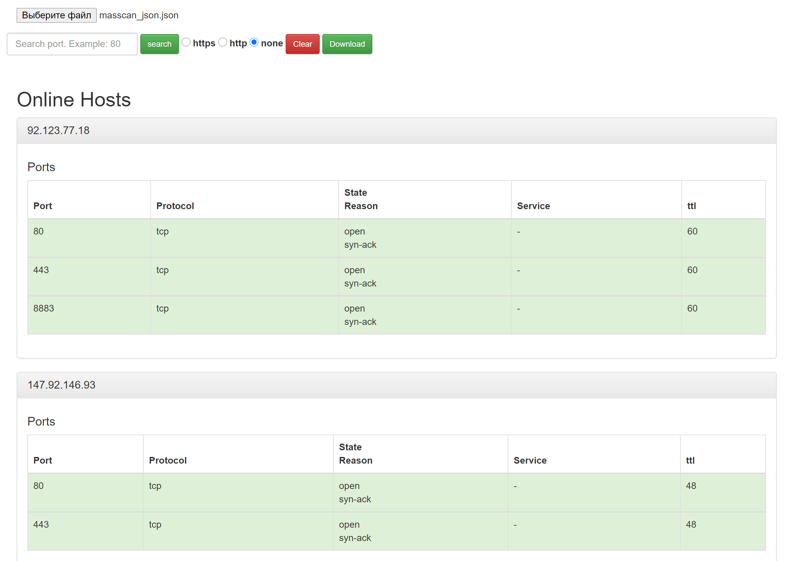
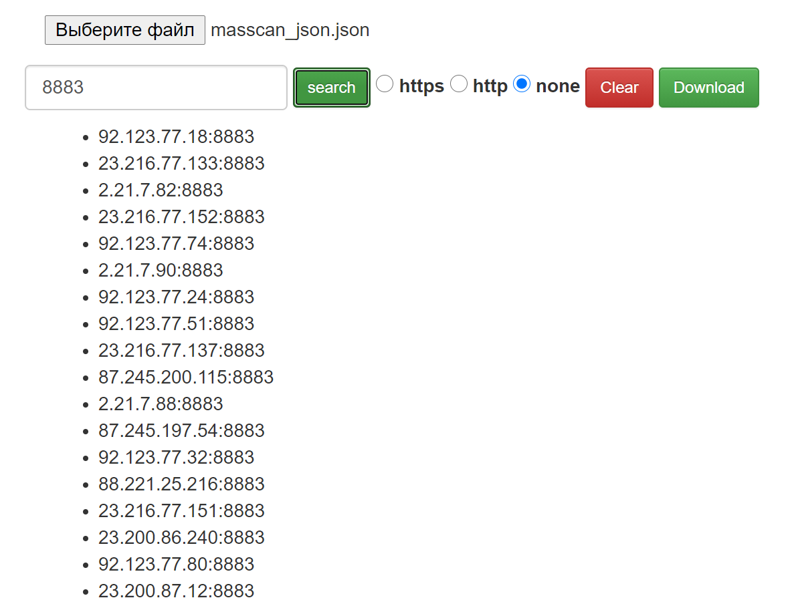

#   masscan-bootstrap

Using this you can beautify your JSON masscan report and do search in this one.
You can do search and download result for further actions - fuzzing and etc.

Fork of [nmap-bootstrap-xsl](https://github.com/honze-net/nmap-bootstrap-xsl)

##  How to use

- scan your scope and get JSON report;
- open masscan-bootstrap.html, click on file input and select your report;
- watch results in the table;

Example:

